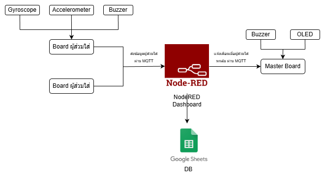
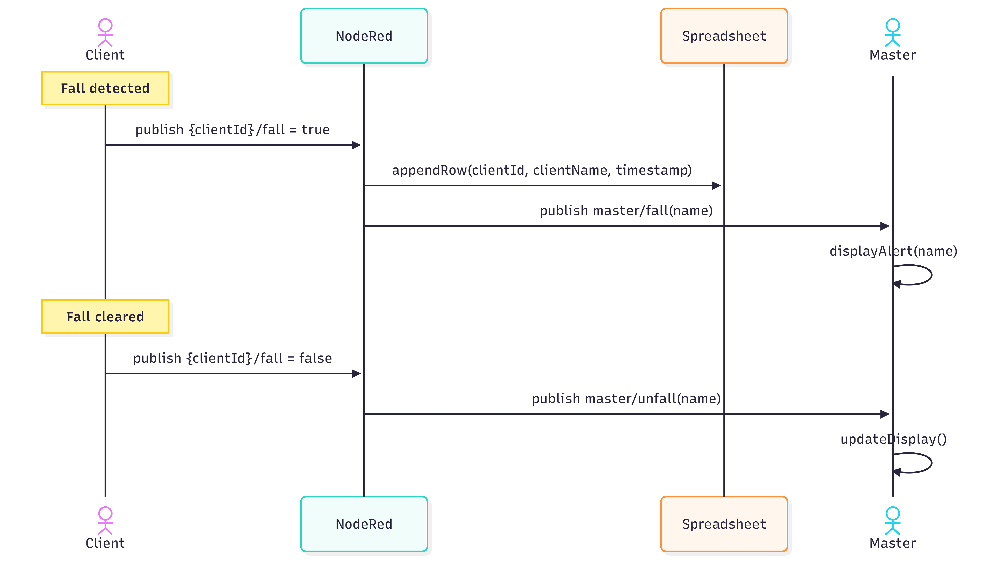
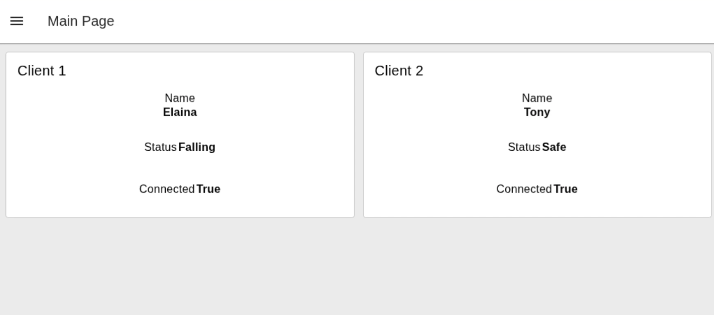
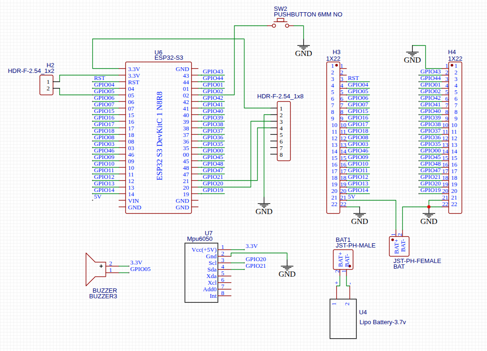
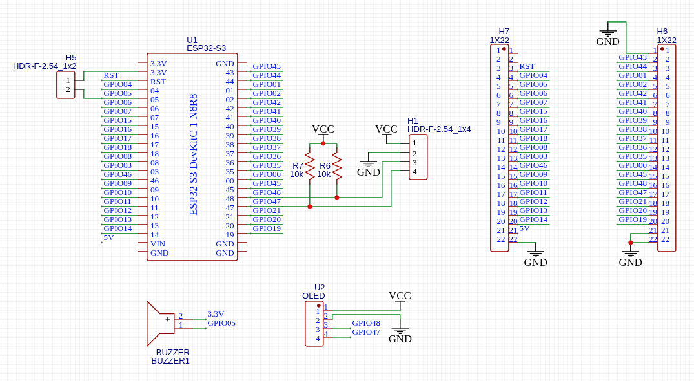

# Smart Fall Detection GOTY Edition Remastered Remake Re:Zero (Fall Detection)

อุปกรณ์สวมใส่ตรวจจับการล้ม ประกอบไปด้วยบอร์ด 2 ส่วนได้เเก่บอร์ดของผู้ส่วมใส่เเละบอร์ดของผู้ดูเเล ช่วยให้ผู้ดูเเลสามารถเข้าไปช่วยเหลือผู้ส่วมใส่ได้ทันท่วงทีหากเกิดอุบัติเหตุ

**โครงงานนี้เป็นส่วนหนึ่งของรายวิชา 01204114 Introduction to Computer Hardware Development ภาควิชาวิศวกรรมคอมพิวเตอร์ คณะวิศวกรรมศาสตร์ มหาวิทยาลัยเกษตรศาสตร์**

**สำหรับการติดตั้งโปรดดูที่[คู่มือ](manual.md)**

## หน้าที่เเละอุปกรณ์ฮาร์ดเเวร์

### บอร์ดผู้ส่วมใส่ (Client Board)

- ตรวจจับการล้ม
- ส่งเสียงผ่าน Buzzer เเละส่งข้อมูลให้ Node Red หากมีคนล้ม
- ปุ่มกดปิดเสียง Buzzer เมื่อปลอดภัย

| อุปกรณ์              | หน้าที่                                                                           |
| -------------------- | --------------------------------------------------------------------------------- |
| ESP32-S3             | ประมวลผลข้อมูลจากเซนเซอร์และควบคุมการทำงานของระบบ                                 |
| MPU-6050             | เซนเซอร์ IMU สำหรับวัดค่า accelerometer และ gyroscope เพื่อตรวจจับเหตุการณ์การล้ม |
| Buzzer               | ส่งเสียงแจ้งเตือนคนใกล้เคียงเมื่อระบบตรวจพบการล้ม                                 |
| Li-Po Battery (3.7V) | แหล่งพลังงานของบอร์ด ทำให้สามารถใช้งานแบบพกพาได้                                  |
| PUSHBUTTON 6MM NO    | กดเพื่อยืนยันว่าผู้ดูแลได้มาตรวจสอบเหตุการณ์หลังจากตรวจพบว่าผู้สูงอายุล้มแล้ว     |

### บอร์ดผู้ดูเเล (Master Board)

- เเสดงรายชื่อผู้ล้มผ่านจอ OLED
- ส่งเสียงผ่าน Buzzer หากมีคนล้ม

| อุปกรณ์  | หน้าที่                                                     |
| -------- | ----------------------------------------------------------- |
| ESP32-S3 | รับข้อมูลจากระบบตรวจจับและประมวลผลการแจ้งเตือนผ่านเครือข่าย |
| OLED     | แสดงสถานะและชื่อของผู้สวมใส่เมื่อเกิดการล้ม                 |
| Buzzer   | แจ้งเตือนด้วยเสียงเมื่อมีการตรวจพบเหตุการณ์ล้ม              |

### Node Red Dashboard

- เเสดงชื่อ สถานะ เเละการเชื่อมต่อของเเต่ละบอร์ด
- รับข้อมูลจากบอร์ดผู้ส่วมใส่ เเละส่งข้อมูลให้บอร์ดผู้ดูเเล
- เชื่อมต่อกับ Google Sheet สำหรับเก็บข้อมูล

### ภาพรวมของระบบ



### Sequence Diagram เเสดงการทำงานเมื่อผู้ส่วมใส่ล้ม


 
### ตัวอย่าง Dashboard


## Schematic

### บอร์ดผู้ส่วมใส่ (Client Board)



### บอร์ดผู้ดูเเล (Master Board)



## Directory

```bash
FallSmart500
│ .gitignore
│ flow.json // flow ของ Node Red
│ LICENSE
│ manual.md // คู่มือการติดตั้ง
│ README.md
│
├── FallSmartClient/ // Firmware ของบอร์ดผู้ส่วมใส่
├── FallSmartMaster/ // Firmware ของบอร์ดผู้ดูเเล
├── TestingPrototype/ // Firmware ของบอร์ดที่ไว้ใช้สำหรับการทดสอบระบบช่วงเเรก
└── images/ // ไฟล์รูปภาพที่เกี่ยวข้อง
```

## Node Red Flow

- **Main** สำหรับการทำงานหลัก
- **Testing Prototype** สำหรับทดสอบระบบ

## Library

ทั้งหมดนี้เป็น Library ที่ถูกใช้ใน [Arduino IDE](https://support.arduino.cc/hc/en-us/articles/360019833020-Download-and-install-Arduino-IDE)

- [LiquidCrystal](https://docs.arduino.cc/libraries/liquidcrystal/)
- [PubSubClient](http://pubsubclient.knolleary.net)
- [MPU6050](https://github.com/electroniccats/mpu6050)
- [Adafruit SSD1306](https://github.com/adafruit/Adafruit_SSD1306)

## สมาชิก

1. นายฐีรชัย พรสุริยะศักดิ์
2. นายนูรุต หวังตักวาดีน
3. [นายพรชัย วรรณสุข](https://github.com/KiseKi7k)
4. [นายวชิรวิทย์ สุขวดี](https://github.com/AWchrw)
